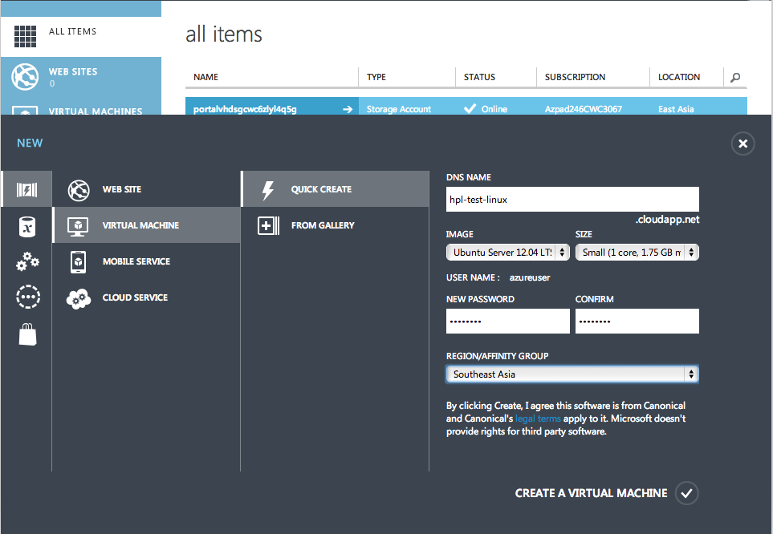
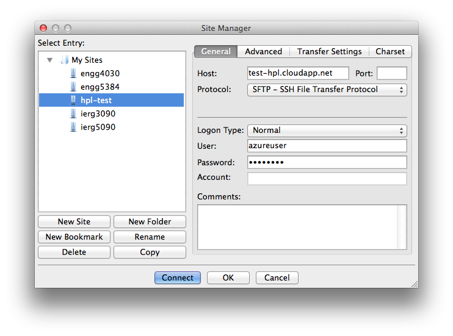
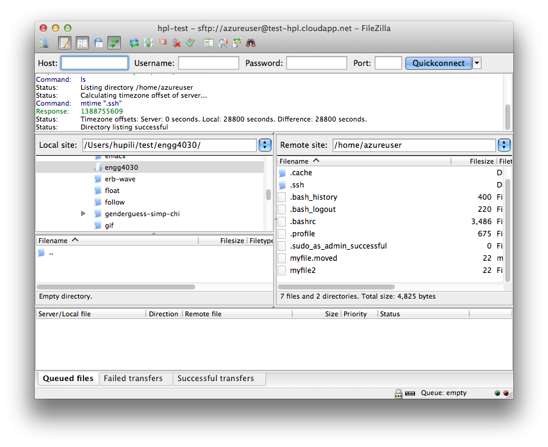

# Basic Linux Operations

A first journey in the cloud. Windows Azure: launch VM, try both windows and Linux, port mapping. Linux 101: navigate around, upload/download files, run programs. In this tutorial, student warms up with the working environment in the semester.

## Tutorial Logistics

   * Organization of tutorial session.
   * Structure of tutorial notes.
   * Notations: optional, NOTE, TIP, EXERCISE

**NOTE**:
We have Windows and Linux desktops in the Lab.
You are also welcome to bring you own laptops.
Choose the desktop environment that suits you best.

## Register Windows Azure

**It takes time for Windows Azure to respond to your request, e.g. about 30 minutes to 1 day. Please finish this section before the tutorial. The Azure academic pass code is sent to your Elearning grading book**

Major steps:

   * Ensure you can receive emails from: `admin@windowsazurepassadmin.com`.
   * Register Windows Live accounts.
   * Register with Windows Azure with academic pass codes.
   <https://www.windowsazurepass.com/azureu>
   (codes will be distributed during the tutorial)

**NOTE**: 
Through out the course, only instructions of major steps are provided.
You need to work out the details on your own. 
Ask Internet first, then your peers, and TA last.

The resource constraints of our academic pass:

   * 5 months availability
   * 2 cores
   * 35 GB storage
   * 50,000,000 sotrage transactions
   * 2 1GB web edition DB
   * **8GB data in/out**

**NOTE**:
Given the limited resources, we will only use it for proof-of-concept (POC) experiments.
Especially watchout for network limit.

## A Tour in the Cloud

   * Management portal of Windows Azure: 
   https://manage.windowsazure.com/
   * The official introduction:
   http://www.windowsazure.com/en-us/documentation/articles/fundamentals-introduction-to-Windows-Azure/

**EXERCISE:**
Find other introductory materials.
Get a feel of what "IaaS" provides in the cloud environment.
Try other components in Azure subject to our academic pass subscription limit,
e.g. website, mobile App, etc.

### Windows VM (optional)

Try one if you have interest.
Use remote desktop connection to access it.
e.g. `mstsc` in windows, `rdesktop` package in Linux.

**TIP**:
In the dashboard, you can find a `CONNECT` button to download an `.rdp` file.
This file can be usd by remote desktop client on windows directly.

**TIP**:
On MAC, you may need to download the latest Microsoft Remote Desktop from 
[iTunes](https://itunes.apple.com/us/app/microsoft-remote-desktop/id715768417).

### Launch a Linux VM

Launch a Linux Virtual Machine (VM).
The "quick create" default options will do.
Fill in required information, e.g.:



Verify it's working in the dashboard.
Navigate around to explore configurations and statistics.

### Connect to Linux VM

   * MAC or Linux: Launch terminal and issue a command like `ssh azureuser@YOUR-DOMAIN-NAME.cloudapp.net`
   * Windows: Find an SSH client, e.g. [PuTTY](http://www.chiark.greenend.org.uk/~sgtatham/putty/) and [Some Others](http://www.putty.org/).

**NOTE**:
`YOUR-DOMAIN-NAME` is the one you put when launching the VM.
For the GUI clients, you need to fill in some connection information,
e.g. port is 22, remote address is `YOUR-DOMAIN-NAME.cloudapp.net`,
user is `azureuser`.

**?SCREENSHOT?** for configurations

A sample output in the terminal:

```
$ssh azureuser@test-hpl.cloudapp.net
Warning: Permanently added the RSA host key for IP address '168.63.148.188' to the list of known hosts.
azureuser@test-hpl.cloudapp.net's password: 
Welcome to Ubuntu 12.04.3 LTS (GNU/Linux 3.2.0-57-virtual x86_64)

 * Documentation:  https://help.ubuntu.com/

  System information as of Mon Jan 13 08:31:10 UTC 2014

  System load:  0.54              Processes:           94
  Usage of /:   3.5% of 28.83GB   Users logged in:     0
  Memory usage: 1%                IP address for eth0: 10.62.144.17
  Swap usage:   0%

  Graph this data and manage this system at https://landscape.canonical.com/

  Get cloud support with Ubuntu Advantage Cloud Guest:
    http://www.ubuntu.com/business/services/cloud

38 packages can be updated.
20 updates are security updates.

Last login: Mon Jan 13 04:56:45 2014 from ip-123-255-102-243.wlan.cuhk.edu.hk
azureuser@test-hpl:~$
```

Now you are in a Linux machine
(Precisely you have a shell called [bash](http://en.wikipedia.org/wiki/Bash_%28Unix_shell%29) ).
This is the default remote environment you will use throughout the course.

**NOTE**:
The above texts from the terminal is the "screenshot" in Linux world.
You will see a lot of this in this class.
Just get used to it.

## Linux 101

Main reference: http://linuxcommand.org/learning_the_shell.php

Concepts to be delivered during tutorial:

   * System, Process, Executable, Shell, Commands, Command-Line-Interface
   * Filesystem, directory tree, 
     [Filesystem Hierarchy Standard](http://en.wikipedia.org/wiki/Filesystem_Hierarchy_Standard)
     [see also](http://linuxcommand.org/lts0040.php)
   * Standard input/output, pipe

### Navigation

```
azureuser@test-hpl:~$ pwd
/home/azureuser
azureuser@test-hpl:~$ ls
azureuser@test-hpl:~$ cd ..
azureuser@test-hpl:/home$ ls
azureuser  ubuntu
azureuser@test-hpl:/home$ cd ..
azureuser@test-hpl:/$ ls
bin   dev  home        lib    lost+found  mnt  proc  run   selinux  sys  usr  vmlinuz
boot  etc  initrd.img  lib64  media       opt  root  sbin  srv      tmp  var
azureuser@test-hpl:/$ pwd
/
```

**NOTE**:
` $ ` is the command prompt, after which you can type a command.
After entering a command, there will be some output.
Rule of thumb: read output carefully, esp. during more complex operations later.
Linux command outputs are usually self-documenting.

### Seeking for help

```
azureuser@test-hpl:/$ ls --help
Usage: ls [OPTION]... [FILE]...
List information about the FILEs (the current directory by default).
Sort entries alphabetically if none of -cftuvSUX nor --sort is specified.

Mandatory arguments to long options are mandatory for short options too.
  -a, --all                  do not ignore entries starting with .
...
```

**NOTE:** 
`...` in the last line denotes omitted console outputs.
Find the complete version by enter the corresponding command.

```
azureuser@test-hpl:/$ man ls

LS(1)                                               User Commands                                               LS(1)

NAME
       ls - list directory contents

SYNOPSIS
       ls [OPTION]... [FILE]...

DESCRIPTION
       List  information  about the FILEs (the current directory by default).  Sort entries alphabetically if none of
       -cftuvSUX nor --sort is specified.

...

       --block-size=SIZE
              scale sizes by SIZE before printing them.  E.g., `--block-size=M' prints sizes in  units  of  1,048,576
              bytes.  See SIZE format below.
 Manual page ls(1) line 1 (press h for help or q to quit)
```

**TIP**:
Use arrow keys or `j`/`k` to move around the manual page.
Use `/` to search for a keyword.
Press `q` to end.

What is the `man` command? Try `man man`

### Basic file/dir operations

Make directories:

```
azureuser@test-hpl:~$ mkdir mydir
azureuser@test-hpl:~$ ls
mydir
azureuser@test-hpl:~$ cd mydir/
azureuser@test-hpl:~/mydir$ pwd
/home/azureuser/mydir
azureuser@test-hpl:~/mydir$ cd ..
azureuser@test-hpl:~$ ls
mydir
azureuser@test-hpl:~$ rmdir mydir
azureuser@test-hpl:~$ ls
azureuser@test-hpl:~$ 
```

Ceate and view text files:

```
azureuser@test-hpl:~$ echo "this is my first file" > myfile
azureuser@test-hpl:~$ ls
myfile
azureuser@test-hpl:~$ cat myfile 
this is my first file
```

`echo` prints the string to `STDOUT`.
`>` redirects `STDOUT` to a file.
[More](http://www.tldp.org/LDP/abs/html/io-redirection.html) on IO redirection.

What is `cat` then? Try `man` or `--help`.

Move/Copy/Remove file:

```
azureuser@test-hpl:~$ ls
myfile
azureuser@test-hpl:~$ cat myfile 
this is my first file
azureuser@test-hpl:~$ cp myfile myfile2
azureuser@test-hpl:~$ ls
myfile  myfile2
azureuser@test-hpl:~$ cat myfile2
this is my first file
azureuser@test-hpl:~$ mv myfile myfile.moved
azureuser@test-hpl:~$ ls
myfile2  myfile.moved
azureuser@test-hpl:~$ rm myfile2
azureuser@test-hpl:~$ ls
myfile.moved
```

**TIP**:
Do more experiments like this.
Use `ls` (probably with options like `-a`, `-l`) to inspect a dir.
Use `cat` or `less`/`more` to inspect the content of a text file.

About filename:

   * Basically a flat string. 
   No concept of "extension name".
   Though, people may have naming conventions sometime.
   * Files start with `.` is "hidden".
   Use `ls -a` to see them.

### File transfer

Major methods:

   * `scp`/`sftp` under Linux/Mac
   * An open source and cross-platform SFTP client: 
   [FileZilla](https://filezilla-project.org/)
   * An SFTP client under windows: [WinSCP](http://winscp.net/eng/index.php)

Pick the one that suits you most.

Tasks:

   * Create a text file in your desktop. 
   Upload it to the server.
   Verify it is same as the file you created locally.
   * Create a text file in your server.
   Download it to your desktop.
   Verify it is same as the file you created remotely.





### File download from the Internet

```
azureuser@test-hpl:~$ mkdir try-wget
azureuser@test-hpl:~$ cd try-wget/
azureuser@test-hpl:~/try-wget$ wget 'https://github.com/hupili/agile-ir/raw/master/data/Shakespeare.tar.gz'
--2014-01-14 03:02:09--  https://github.com/hupili/agile-ir/raw/master/data/Shakespeare.tar.gz
Resolving github.com (github.com)... 192.30.252.131

...

azureuser@test-hpl:~/try-wget$ ls
Shakespeare.tar.gz
```

Now you have downloaded Shakespeare's works, all in one compressed archive `Shakespeare.tar.gz`.
Following is a shortcut to uncompress it:

```
azureuser@test-hpl:~/try-wget$ tar -xzvf Shakespeare.tar.gz 
data/
data/sonnet-59.txt
data/sonnet-139.txt
data/sonnet-88.txt
data/sonnet-123.txt
data/sonnet-137.txt
data/play-twogents.txt

...

data/sonnet-134.txt
data/sonnet-93.txt
data/sonnet-24.txt
data/sonnet-3.txt
data/play-juliuscaesar.txt
```

What's `-xzvf`? Try `man` or `--help`.

**NOTE**:
Some commands have shorthand notation for multiple options.
In the above example, `tar -xzvf YOUR_FILE` is equivalent of `tar -x -z -v -f YOUR_FILE`.
Try the latter one yourself.

**EXERCISE**:
Navigate the `data` dir and operate on those files, e.g. `cp`, `mv`.

**EXERCISE**:
Get familiar with `tar`, `zip`, `gzip`, `bzip2`.
You are very likely to get others' data in those formats.

**EXERCISE**:
Get familiar with `wget` options.
A simple crawler can be obtained by `wget -r START_URL`.

**EXERCISE**:
Try to use `curl` to download the same file.
Most Linux distribution has `wget` and/or `curl` by default.

Suppose you have finished processing `data`.
Cleanup as follows:

```
azureuser@test-hpl:~/try-wget$ ls
data  Shakespeare.tar.gz
azureuser@test-hpl:~/try-wget$ ls data/
play-12night.txt         play-titus.txt              sonnet-122.txt  sonnet-152.txt  sonnet-42.txt  sonnet-72.txt

...

play-tempest.txt         sonnet-120.txt              sonnet-150.txt  sonnet-40.txt   sonnet-70.txt
play-timonathens.txt     sonnet-121.txt              sonnet-151.txt  sonnet-41.txt   sonnet-71.txt
azureuser@test-hpl:~/try-wget$ rm -rf data/
azureuser@test-hpl:~/try-wget$ ls
Shakespeare.tar.gz
```

`rm -rf` is a powerful command.
Use with great care.

### Execute an executable file

Write your first shell script

```
azureuser@test-hpl:~$ cat > hello.sh
echo "hello world. My first shell script!"
azureuser@test-hpl:~$ ls
hello.sh
azureuser@test-hpl:~$ cat hello.sh 
echo "hello world. My first shell script!"
```

`cat >` reads STDIN and redirect all the content to `hello.sh`.
The second line `echo "hello world. My first shell script!"` is typed by you.
After that press `ctrl+d` to end typing.

**EXERCISE**:
Try this way to create more files.
This is the simplest way to write small text files without using a text-based editor.

Make it executable:

```
azureuser@test-hpl:~$ ls -l hello.sh 
-rw-rw-r-- 1 azureuser azureuser 43 Jan 14 07:26 hello.sh
azureuser@test-hpl:~$ chmod a+x hello.sh 
azureuser@test-hpl:~$ ls -l hello.sh 
-rwxrwxr-x 1 azureuser azureuser 43 Jan 14 07:26 hello.sh
```

The `x` character indicates that the file is executable.
Read [more](http://en.wikipedia.org/wiki/File_system_permissions).

Execute it:

```
azureuser@test-hpl:~$ ./hello.sh 
hello world. My first shell script!
azureuser@test-hpl:~$ /home/azureuser/hello.sh 
hello world. My first shell script!
```

**NOTE**:
One often ignored syntax:
If the executable is under current working directory, prefix it with `./`.
Or else, the system will try to locate that command in [PATH](http://en.wikipedia.org/wiki/PATH_%28variable%29).

### About shell commands (optional)

The commands you use, e.g. `ls`, `cd`, `mkdir`, are just some pre-installed executables in the system.
You can find their location and verify that they are executable:

```
azureuser@test-hpl:~$ which ls
/bin/ls
azureuser@test-hpl:~$ ls -l /bin/ls
-rwxr-xr-x 1 root root 105840 Nov 19  2012 /bin/ls
```

`which` itself is an executable file:

```
azureuser@test-hpl:~$ which which 
/usr/bin/which
azureuser@test-hpl:~$ ls -l /usr/bin/which
lrwxrwxrwx 1 root root 10 Mar 29  2012 /usr/bin/which -> /bin/which
azureuser@test-hpl:~$ ls -l /bin/which 
-rwxr-xr-x 1 root root 946 Mar 29  2012 /bin/which
```

### Automate your work by shell

Create a script, `download.sh` , with the following content. 

```bash
# Clean previously downloaded data
rm -f Shakespeare.tar.gz
rm -rf data/
# Download
wget 'https://github.com/hupili/agile-ir/raw/master/data/Shakespeare.tar.gz'
# Uncompress 
tar -xzvf Shakespeare.tar.gz 
# list files
ls data/
```

**TIP**:
No need to type in.
Use `cat >` and copy paste the content into your terminal.
The paste operations are different across terminals.

Content after `#` is comment.

Now execute the script:

```
azureuser@test-hpl:~$ chmod a+x download.sh 
azureuser@test-hpl:~$ ./download.sh 

...
```

The result is same as that when you type those commands in shell one by one directly.
By writing scripts, you can automate tedious daily jobs.
You will see some of this in the later part of this course.

**EXERCISE**:
Shell scripts also supports common programming constructs, e.g. condition, loop, etc.
Try to self-learn them from the Internet.
Google "bash script" or something similar.

## Linux 102 (optional)

Those are optional in the first tutorial due to time limit
but we will encounter them in following tutorials.
Just-In-Time instructions will be given
but it's strongly recommended that you warm up at the earliest convenience. 

### Text editor -- VIM and others

With linux 101, you can at least operate in the following way:

   * Write codes in your desktop locally with you favourite GUI editor.
   * Upload codes and data to that Linux server.
   * Execute.
   * Download result and analyze.

This upload/download cycle causes considerable overheads when you need to frequently modify codes or configuraiton files.

[VIM](http://www.vim.org/) is a powerful text editor.
There are many tutorials and guides online.

[Emacs](http://www.gnu.org/software/emacs/) is also a widely available and highly customizable text editor.
It's interesting to learn some Emacs basic operations and concepts.

Sometimes, [nano](http://www.nano-editor.org/) will be fired up to input cerntain information.

Text editors are just tools.
Pick one that is most convenient to you.

### Package management

Cheatsheet for Ubuntu:

   * `sudo apt-get install PACKAGE`
   * `sudo apt-get purge PACKAGE`
   * `sudo apt-file search FILE_NAME`

Ubuntu will friendly prompt you for package installation.
e.g. installing [Git](http://git-scm.com/)

```
azureuser@test-hpl:~$ git
The program 'git' is currently not installed.  You can install it by typing:
sudo apt-get install git
azureuser@test-hpl:~$ sudo apt-get install git
Reading package lists... Done
Building dependency tree

...

After this operation, 15.2 MB of additional disk space will be used.
Do you want to continue [Y/n]? y
Get:1 http://azure.archive.ubuntu.com/ubuntu/ precise/main liberror-perl all 0.17-1 [23.8 kB]

...

Setting up git-man (1:1.7.9.5-1) ...
Setting up git (1:1.7.9.5-1) ...
azureuser@test-hpl:~$ git
usage: git [--version] [--exec-path[=<path>]] [--html-path] [--man-path] [--info-path]
           [-p|--paginate|--no-pager] [--no-replace-objects] [--bare]

...

   rm         Remove files from the working tree and from the index
   show       Show various types of objects
   status     Show the working tree status
   tag        Create, list, delete or verify a tag object signed with GPG

See 'git help <command>' for more information on a specific command.
```

### dotfiles

Use `ls -al` and you will see many dotfiles (e.g. `.bashrc`).
`.XXXrc` is the convention for customized configurations.
You can bulid the best working environment for you via those configuration files,
e.g. change color, add command alias, etc.

Try to search the Internet and do some customization.
Many people put their own configs online, [example](https://github.com/hupili/utility/tree/master/dotfiles).
You can get some pointers from those repos.

## Further Pointers

   * One MOOC [Startup Engineering](https://class.coursera.org/startup-001/) has useful materials to engage one into the Linux world.
   See Week 2: Linux, Command Line, SSJS, Emacs, Git, Dotfiles.
   (<i class="fa fa-thumbs-up fa-fw"></i> Robin Lee)

## Outcome of This Tutorial

   * You have a feel of IaaS via Azure.
   * You can operate a Linux server using shell.
   * You can upload/download code/data to/from the remote Linux server.
   * You have basic idea of a shell script and the use of it for automation.
   * You feel comfortable reading CLI examples.
