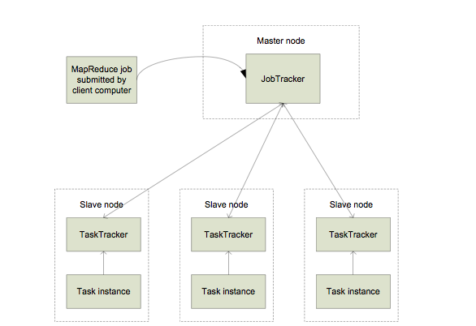

# Single Node Hadoop Setup

Hadoop 101.
Student will setup their first single-node Hadoop.
Student can do a POC by running examples provided by Hadoop project.

## Single-node Hadoop Setup

Concepts to be delivered:

   * Hadoop
   * Hadoop client
   * Layout of Hadoop software package



## Install a single-node Hadoop:

**Prerequisites:**

Sun Java 6:

Hadoop requires a working Java 1.5+ (aka Java 5) installation. However, using Java 1.6 (aka Java 6) is recommended for running Hadoop. For the sake of this tutorial, I will therefore describe the installation of Java 1.6.

```
sudo apt-get update
sudo apt-get install openjdk-6-jdk
```
Notes:Other methods to install java on Linux.[link](http://www.wikihow.com/Install-Java-on-Linux)


After installation, make a quick check whether JDK is correctly set up:

```
azureuser@ronghai-test:~$ java -version
java version "1.6.0_27"
OpenJDK Runtime Environment (IcedTea6 1.12.6) (6b27-1.12.6-1ubuntu0.12.04.4)
OpenJDK 64-Bit Server VM (build 20.0-b12, mixed mode)
```

**Download the Hadoop Package**

```
azureuser@ronghai-test:~$ mkdir hadoop
azureuser@ronghai-test:~$ cd hadoop
azureuser@ronghai-test:~/hadoop$ ls
azureuser@ronghai-test:~/hadoop$  wget 'http://archive.apache.org/dist/hadoop/core/hadoop-1.0.3/hadoop-1.0.3.tar.gz'
azureuser@ronghai-test:~/hadoop$ ls
hadoop-1.0.3.tar.gz
```

Extract the contents of the Hadoop package to a location of your choice. I picked /opt/hadoop

```
azureuser@ronghai-test:~/hadoop$  tar -xzf hadoop-1.0.3.tar.gz
azureuser@ronghai-test:~/hadoop$ ls
hadoop-1.0.3  hadoop-1.0.3.tar.gz

azureuser@ronghai-test:~/hadoop$ cd /opt
azureuser@ronghai-test:/opt$ sudo mv /home/azureuser/hadoop/hadoop-1.0.3 hadoop
azureuser@ronghai-test:/opt$ ls
hadoop
```


**Set Hadoop-related environment variables**

```
azureuser@ronghai-test:/opt$ export HADOOP_HOME=/opt/hadoop
azureuser@ronghai-test:/opt$ export JAVA_HOME=/usr/lib/jvm/java-6-openjdk-amd64
azureuser@ronghai-test:/opt$ export PATH=$PATH:$HADOOP_HOME/bin
```

**TIP**:
You may see [a warning](http://stackoverflow.com/questions/9286983/hadoop-home-is-deprecated) in later sections.
The reason is that `HADOOP_HOME` is deprecated.
You can use `HADOOP_PREFIX` as the new recommended environment variable.
(<i class="fa fa-thumbs-up fa-fw"></i> Robin Lee)

**TIP**:
You may see a warning that deprecates `localhost:9000` for `fs.default.name`.
Use `hdfs://localhost:9000` to solve it.
(<i class="fa fa-thumbs-up fa-fw"></i> Gao Ruohan)

**Hadoop configuration**

### Configuring SSH

Hadoop requires SSH access to manage its nodes, i.e. remote machines plus your local machine if you want to use Hadoop on it (which is what we want to do in this short tutorial). For our single-node setup of Hadoop, we therefore need to configure SSH access to localhost

First, we have to generate an SSH key. Press `Enter` to continue.

```
azureuser@ronghai-test:/opt/hadoop$ ssh-keygen -t rsa
Generating public/private rsa key pair.
Enter file in which to save the key (/home/azureuser/.ssh/id_rsa): 
Enter passphrase (empty for no passphrase): 
Enter same passphrase again: 
Your identification has been saved in /home/azureuser/.ssh/id_rsa.
Your public key has been saved in /home/azureuser/.ssh/id_rsa.pub.
The key fingerprint is:
6a:d1:ac:2b:46:13:dc:0c:91:b3:4f:6f:5c:62:81:a7 azureuser@ronghai-test
The key's randomart image is:
+--[ RSA 2048]----+
|    .o .         |
|    + . o        |
|   . * o .       |
|    + Eoo .      |
|     +.+So       |
|    o .++        |
|   . .+.         |
|    o. .         |
|   . ..          |
+-----------------+
```
Second, we have to enable SSH access to the local machine with this newly created key.

```
azureuser@ronghai-test:/opt/hadoop$ cat $HOME/.ssh/id_rsa.pub >> $HOME/.ssh/authorized_keys
```

The final step is to test the SSH setup by connecting to localhost

```
azureuser@ronghai-test:/opt/hadoop$ ssh localhost
The authenticity of host 'localhost (127.0.0.1)' can't be established.
ECDSA key fingerprint is d8:d5:6c:80:95:9e:cb:0e:48:35:f2:a1:3c:b8:96:fb.
Are you sure you want to continue connecting (yes/no)? yes
Warning: Permanently added 'localhost' (ECDSA) to the list of known hosts.
Welcome to Ubuntu 12.04.3 LTS (GNU/Linux 3.2.0-57-virtual x86_64)

 * Documentation:  https://help.ubuntu.com/

  System information as of Sun Jan 19 09:44:16 UTC 2014

  System load:  0.04              Processes:           93
  Usage of /:   5.2% of 28.83GB   Users logged in:     1
  Memory usage: 13%               IP address for eth0: 10.62.150.8
  Swap usage:   0%

  Graph this data and manage this system at https://landscape.canonical.com/

  Get cloud support with Ubuntu Advantage Cloud Guest:
    http://www.ubuntu.com/business/services/cloud

Last login: Sun Jan 19 09:28:49 2014 from iewlangw.ie.cuhk.edu.hk
```
Note that you should return to /opt/hadoop directory

```
cd /opt/hadoop
```

### hadoop-env.sh

You can leave the settings below “as is” with the exception of the hadoop.tmp.dir parameter – this parameter you must change to a directory of your choice. We will use the directory /app/hadoop/tmp in this tutorial.

```
mkdir /app/hadoop/tmp
azureuser@ronghai-test2:/opt/hadoop$ sudo chown azureuser:azureuser /app/hadoop/tmp
#you can check the owner and group of tmp
azureuser@ronghai-test2:/opt/hadoop$ ls -l /app/hadoop
total 4
drwxr-xr-x 2 azureuser azureuser 4096 Jan 19 14:35 tmp
```

**NOTE**: 
If you forget to set the required ownerships and permissions, you will see a java.io.IOException when you try to format the name node in the next section).

You are encouraged to manually set these configurations with vim editor. For your simplicity, you can also just download the configuration files and use it directly. If so, you can go to the `Starting Cluster` Section.

```
azureuser@ronghai-test:/opt/hadoop$ wget --http-user=engg4030 --http-password=spring4030engg 'https://course.ie.cuhk.edu.hk/~engg4030/tutorial/tutorial2/conf.tar.gz'

azureuser@ronghai-test:/opt/hadoop$ rm -rf conf
azureuser@ronghai-test:/opt/hadoop$ tar -xzvf conf.tar.gz 
```

The only required environment variable we have to configure for Hadoop in this tutorial is JAVA_HOME. Open conf/hadoop-env.sh with vim (if you used the installation path in this tutorial, the full path is /opt/hadoop/conf/hadoop-env.sh) and set the JAVA_HOME environment variable to the JDK/JRE 6 directory.

```
azureuser@ronghai-test:/opt/hadoop$ vim conf/hadoop-env.sh
```

Change

```
# export JAVA_HOME=/usr/lib/j2sdk1.5-sun
```

to

```
export JAVA_HOME=/usr/lib/jvm/java-6-openjdk-amd64
```

**TIP**:
In VIM, use `i` to enter the insert mode; move cursor by arrow keys; do your edits; type `<ESC>` to end insert mode; type `:wq` to save and quit the editor.
You are suggested to learn more about VIM after the tutorial.

* \*-site.xml

In this section, we will configure the directory where Hadoop will store its data files, the network ports it listens to, etc. Our setup will use Hadoop’s Distributed File System, HDFS, even though our little “cluster” only contains our single local machine. 

Add the following snippets between the <configuration> ... </configuration> tags in the respective configuration XML file.

In file conf/core-site.xml:

```
<configuration>
  <property>
    <name>hadoop.tmp.dir</name>
    <value>/app/hadoop/tmp</value>
    <description>A base for other temporary directories.</description>
  </property>
  <property>
     <name>fs.default.name</name>
     <value>hdfs://localhost:9000</value>
  </property>
</configuration>
```

In file conf/mapred-site.xml:

```
<configuration>
     <property>
         <name>mapred.job.tracker</name>
         <value>localhost:9001</value>
     </property>
</configuration>
```
In file conf/hdfs-site.xml:

```
<configuration>
     <property>
         <name>dfs.replication</name>
         <value>3</value>
     </property>
</configuration>
```

## Starting Cluster

**Format Namenode**

The first step to starting up your Hadoop installation is formatting the Hadoop filesystem which is implemented on top of the local filesystem of your “cluster” (which includes only your local machine if you followed this tutorial). You need to do this the first time you set up a Hadoop cluster.

Note: Do not format a running Hadoop filesystem as you will lose all the data currently in the cluster (in HDFS)! 


To format the filesystem (which simply initializes the directory specified by the dfs.name.dir variable), run the command

```
bin/hadoop namenode -format
```


**Starting Single-Node Cluster**

Run the command:

```
azureuser@ronghai-test:/opt/hadoop$ bin/start-all.sh
starting namenode, logging to /opt/hadoop/libexec/../logs/hadoop-azureuser-namenode-ronghai-test.out
localhost: starting datanode, logging to /opt/hadoop/libexec/../logs/hadoop-azureuser-datanode-ronghai-test.out
localhost: starting secondarynamenode, logging to /opt/hadoop/libexec/../logs/hadoop-azureuser-secondarynamenode-ronghai-test.out
starting jobtracker, logging to /opt/hadoop/libexec/../logs/hadoop-azureuser-jobtracker-ronghai-test.out
localhost: starting tasktracker, logging to /opt/hadoop/libexec/../logs/hadoop-azureuser-tasktracker-ronghai-test.out
```
A nifty tool for checking whether the expected Hadoop processes are running is jps (part of Sun’s Java since v1.5.0). 

```
azureuser@ronghai-test:/opt/hadoop$ jps
19923 Jps
12581 SecondaryNameNode
12847 TaskTracker
12398 DataNode
12669 JobTracker
12216 NameNode
```
If there are any errors, examine the log files in the /logs/ directory.

## Hadoop Distributed File System

HDFS is the primary distributed storage used by Hadoop applications. A HDFS cluster primarily consists of a NameNode that manages the file system metadata and DataNodes that store the actual data. In this tutorial, we list several common commands that can access and manage the HDFS.

* Upload files

Basically, it's difficult to edit files in HDFS since it does't provide edit tool such as `vim in Linux`. Therefore, a common way is to edit the file locally and then upload it to the HDFS.

Create a data file locally

```
azureuser@ronghai-test2:/opt/hadoop$ cat > data
123
234
345
```

**TIP**:
Use `ctrl+d` to end the input when you use the `cat >` approach to create file.

```
# use copyFromLocal to upload file
azureuser@ronghai-test2:/opt/hadoop$ bin/hadoop dfs -copyFromLocal data desdata

#check the file with ls command
azureuser@ronghai-test2:/opt/hadoop$ bin/hadoop dfs -ls

#check the content of the file with cat
azureuser@ronghai-test2:/opt/hadoop$ bin/hadoop dfs -cat desdata
123
234
345
```

* Directory Operation

```
# use mkdir to create a directory
azureuser@ronghai-test2:/opt/hadoop$ bin/hadoop dfs -mkdir tutorial2

# mv the desdata into this folder
azureuser@ronghai-test2:/opt/hadoop$ bin/hadoop dfs -mv desdata tutorial2
azureuser@ronghai-test2:/opt/hadoop$ bin/hadoop dfs -ls tutorial2
Found 1 items
-rw-r--r--   3 azureuser supergroup         12 2014-01-19 15:14 /user/azureuser/tutorial2/desdata

# download the files in HDFS to local machine
azureuser@ronghai-test2:/opt/hadoop$ bin/hadoop dfs -copyToLocal tutorial2 localdata
azureuser@ronghai-test2:/opt/hadoop$ ls localdata/
desdata
azureuser@ronghai-test2:/opt/hadoop$ cat localdata/desdata 
123
234
345

# remove the HDFS directory and files
azureuser@ronghai-test2:/opt/hadoop$ bin/hadoop dfs -rm tutorial2/desdata
```
* Help command

You can use help command to get a list of commands. There are quite similar to the commands in Linux. Just try it.

```
azureuser@ronghai-test2:/opt/hadoop$ bin/hadoop dfs -help
```

## Running a MapReduce Job

**Word Count Example**

We will now run your first Hadoop MapReduce job. We will use the WordCount example job which reads text files and counts how often words occur. The input is text files and the output is text files, each line of which contains a word and the count of how often it occurred, separated by a tab.

Download each ebook as text files in Plain Text UTF-8 encoding and store the files in a local temporary directory of choice, for example /opt/hadoop/data

```
azureuser@ronghai-test:/opt/hadoop$ wget 'https://github.com/hupili/agile-ir/raw/master/data/Shakespeare.tar.gz'
azureuser@ronghai-test:/opt/hadoop$ mkdir data
azureuser@ronghai-test:/opt/hadoop$ mv Shakespeare.tar.gz data
azureuser@ronghai-test:/opt/hadoop$ ls data
Shakespeare.tar.gz
azureuser@ronghai-test:/opt/hadoop$ tar -xzvf data/Shakespeare.tar.gz -o data
azureuser@ronghai-test:/opt/hadoop$ rm data/Shakespeare.tar.gz 
```

Now we have downloaded the input data in the local machine (Microsoft Azure), we still need to upload these data to the HDFS.

```
azureuser@ronghai-test:/opt/hadoop$ bin/hadoop dfs -copyFromLocal data data
```
We can see the folder has been uploaded to the HDFS by this command:

```
azureuser@ronghai-test:/opt/hadoop$ bin/hadoop dfs -ls
drwxr-xr-x   - azureuser supergroup          0 2014-01-19 06:22 /user/azureuser/data
```

We can use help command to learn more functionalities of HDFS

```
azureuser@ronghai-test:/opt/hadoop$ bin/hadoop dfs -help
```
Now it's time for lauching a MapReduce Job. The Hadoop distribution comes with a number of benchmarks, which are bundled in `hadoop-*test*.jar` and `hadoop-*examples*.jar`. The two benchmarks we will be looking at in more details are word count and TeraSort (in `hadoop-*examples*.jar`).

```
azureuser@ronghai-test:/opt/hadoop$ bin/hadoop jar hadoop-examples-1.0.3.jar wordcount data result
```
This command specify the example name (`wordcount`), the input data file/folder (`data` in `Hadoop file system`) and the output folder (`result` in `HDFS`)

**Small files Problem in Hadoop File System**:HDFS is not geared up to efficiently accessing small files: it is primarily designed for streaming access of large files. Reading through small files normally causes lots of seeks and lots of hopping from datanode to datanode to retrieve each small file, all of which is an inefficient data access pattern.

**Small files Problem in MapReduce**:Map tasks usually process a block of input at a time (using the default FileInputFormat). If the file is very small and there are a lot of them, then each map task processes very little input, and there are a lot more map tasks, each of which imposes extra bookkeeping overhead. 

In the last try, we have noticed that it takes quite a long time to process the Shakespeare work due to the small files problem. If these Shakespeare words are all in a single file, it will takes significant less time to count the word. Commands are as follows.

```
#merge small files into one large file
azureuser@ronghai-test:/opt/hadoop$ pwd
/opt/hadoop
azureuser@ronghai-test:/opt/hadoop$ cat data/* > largefile

#upload largefile to HDFS
azureuser@ronghai-test:/opt/hadoop$ bin/hadoop dfs -copyFromLocal largefile largedata

#lauch the word count job again
azureuser@ronghai-test:/opt/hadoop$ bin/hadoop jar hadoop-examples-1.0.3.jar wordcount largedata largeresult

#check the result
azureuser@ronghai-test:/opt/hadoop$ bin/hadoop dfs -cat largeresult/part-r-00000
```
**TeraSort benchmark suite**

Basically, the goal of TeraSort is to sort 1TB of data (or any other amount of data you want) as fast as possible. It is a benchmark that combines testing the HDFS and MapReduce layers of an Hadoop cluster. 
A full TeraSort benchmark run consists of the following three steps:

    Generating the input data via `TeraGen`.
    Running the actual `TeraSort` on the input data.
    Validating the sorted output data via `TeraValidate`.

TeraGen: Generate the TeraSort input data

```
azureuser@ronghai-test:/opt/hadoop$ bin/hadoop jar hadoop-*examples*.jar teragen 1000000 terasort-input
```

TeraSort: Run the actual TeraSort benchmark

```
bin/hadoop jar hadoop-*examples*.jar terasort terasort-input terasort-output
```
TeraValidate: Validate the sorted output data of TeraSort

TeraValidate ensures that the output data of TeraSort is globally sorted.

```
azureuser@ronghai-test:/opt/hadoop$ bin/hadoop jar hadoop-*examples*.jar teravalidate terasort-output terasort-validate
```

##Further tips and tricks

### Job statistics

Hadoop provides a very convenient way to access statistics about a job from command line. Here is an exemplary snippet of word count job statistics from previous test.

```
#the word count statistics. The largeresult is the output directory
azureuser@ronghai-test:/opt/hadoop$ bin/hadoop job -history largeresult
Hadoop job: 0007_1390117159754_azureuser
=====================================
Job tracker host name: job
job tracker start time: Thu May 20 00:46:21 UTC 1976
User: azureuser
JobName: word count
JobConf: hdfs://localhost:9000/tmp/hadoop-azureuser/mapred/staging/azureuser/.staging/job_201401181514_0007/job.xml
Submitted At: 19-Jan-2014 07:39:19
Launched At: 19-Jan-2014 07:39:20 (0sec)
Finished At: 19-Jan-2014 07:40:11 (51sec)
Status: SUCCESS
Counters: 
...

```

### More options

You can specify some options for hadoop command, e.g. supplement files, limit number of mapper and reducer.
See references for official docs.

**NOTE**:
Generic options must come before streaming options.
The command line you copy-and-paste from some online posts may not work due to the ordering problem!

## Outcome

   * Have a rough idea of Hadoop package.
   * Have a rough idea of the workflow of running a Hadoop MapReduce job.

## References

   * Hadoop streaming: http://hadoop.apache.org/docs/stable1/streaming.html
   * Write your own scripts in python: http://www.michael-noll.com/tutorials/writing-an-hadoop-mapreduce-program-in-python/
   * Generic command options: <http://hadoop.apache.org/docs/stable1/streaming.html#Generic+Command+Options>
   * Streaming commmand options: <http://hadoop.apache.org/docs/stable1/streaming.html#Streaming+Command+Options>
